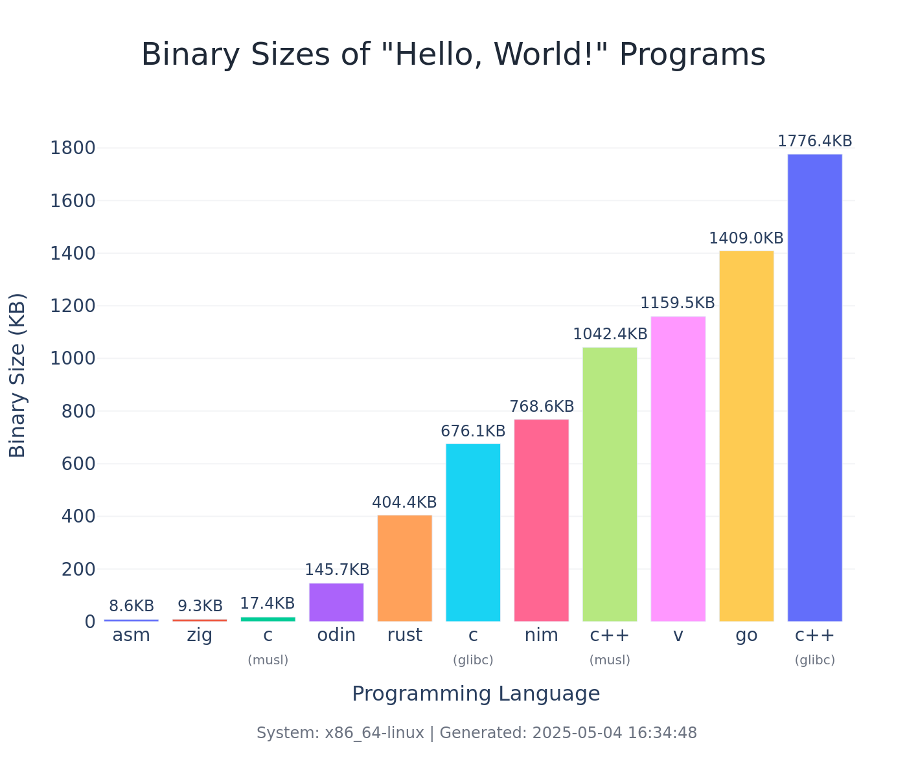

# Hello World Sizes

📦 Compare the static binary size of a **"Hello, World!"** program across programming languages.

This project automatically builds and records binary sizes of "Hello, World!" implementations for various languages like C, C++, Rust, Go, Zig, Nim, V, and more — all **statically linked**!

---

## 📝 Rules

To ensure fair and meaningful comparisons:

* ✅ Each "Hello, World!" program must be idiomatic in its language (e.g. no inline assembly, etc.).
* ✅ Output must be a simple "Hello, World!" to stdout.
* ✅ Only statically linked binaries are allowed.
* ✅ Standard toolchains only (no exotic or size-optimized forks).
* ✅ Compiler optimizations (e.g. -Os, -s) are allowed and noted.

---

## 🧩 How to add a new language

1. Copy the [src/_template](src/_template) directory and and rename it to match the language name (e.g. `src/go`, `src/rust`).
2. Update `src/{lang}/flake.nix` to build a statically linked `hello` binary in that language.
3. Add the new language to the `inputs` and `langs` list in the top-level [flake.nix](flake.nix).
4. Run `nix run` to build the new language and generate a report.

---

## 🎯 Goals

The goal of this project is to help me learn ❄️ [Nix](https://nixos.org/) + [Flakes](https://nixos.wiki/wiki/Flakes) by creating reproducible builds and comparing static binary sizes across languages.

---

## 📊 Reports

View historical reports under [`./.github/reports/`](./.github/reports/)
